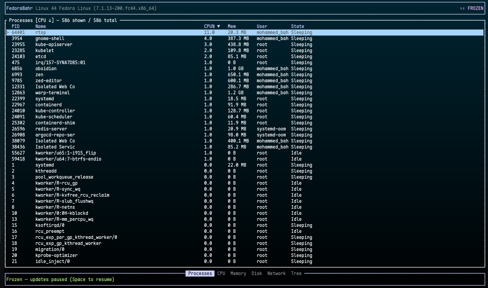

# rtop

A modern Linux terminal system monitor written in Rust — inspired by classic
tools like `top`, `htop`, `btop` and the original `ptop`, but built on a
clean, modular architecture with [ratatui], [crossterm] and [sysinfo].

[ratatui]: https://ratatui.rs
[crossterm]: https://github.com/crossterm-rs/crossterm
[sysinfo]: https://github.com/GuillaumeGomez/sysinfo



## Features

- **Processes** — full process table (PID, parent, name, command, CPU,
  memory, virtual memory, user, state, start time, runtime) with sorting,
  incremental search/filter and stable selection that follows a PID across
  refreshes instead of jumping around.
- **Process management** — `SIGTERM`, `SIGKILL`, `SIGSTOP`, `SIGCONT` with
  confirmation dialogs for destructive signals and graceful handling of
  permission errors.
- **Process tree** — hierarchical view with expand/collapse nodes; cycles in
  malformed parent data are detected rather than looping forever.
- **CPU** — total + per-core utilisation, per-core frequency, load average,
  package temperature (best effort) and rolling history graph.
- **Memory** — RAM/swap gauges, totals, available memory and history graphs.
- **Disk** — mounted filesystems with usage, plus aggregate read/write
  throughput sampled from `/proc/diskstats`.
- **Network** — per-interface RX/TX rates and lifetime totals.
- **Details view** — per-process popup with bounded CPU/memory history
  sparklines for the selected process.
- **Freeze mode** — press `Space` to pause all data updates while the UI
  stays fully interactive: navigate, search, open details or take clean
  screenshots. Unfreezing shows current data immediately (no replay).
- **Configuration** — TOML config file (`refresh_ms`, default sort,
  history length, theme, visible columns).
- **Bounded resources** — history buffers are fixed-capacity ring buffers;
  per-process history is capped at 128 tracked PIDs.

## Requirements

- Linux (uses `/proc/diskstats`; everything else comes from sysinfo)
- A terminal with UTF-8 support (256-color or truecolor recommended)
- Rust 1.85 or newer (the project uses the Rust 2024 edition)

## Installation

### Quick Install

Download and install the latest verified GitHub Release into `~/.local/bin`:

```bash
curl -fsSL https://raw.githubusercontent.com/Mohammed-Bahr/rtop/main/install.sh | sh
```

The installer detects the operating system and architecture, verifies the
release archive with SHA256, and does not require `sudo`. If `~/.local/bin`
is not in `PATH`, it prints the export command to add.

### Manual Installation

Open the [GitHub Releases](https://github.com/Mohammed-Bahr/rtop/releases)
page, download the archive matching your platform and architecture, and
verify it against `checksums.txt` before extracting `rtop` (or `rtop.exe` on
Windows) into a directory on your `PATH`.

To remove an installation made by the script:

```bash
curl -fsSL https://raw.githubusercontent.com/Mohammed-Bahr/rtop/main/uninstall.sh | sh
```

### Windows PowerShell (Sorry but not Working yet i still working on it)

In PowerShell, install the latest Windows x86_64 release into
`$HOME\.local\bin` with:

```powershell
irm https://raw.githubusercontent.com/Mohammed-Bahr/rtop/main/install.ps1 | iex
```

The script verifies the downloaded ZIP with SHA256 and adds the install
directory to your user `PATH`. Open a new PowerShell window after installation,
then run:

```powershell
rtop
```

Remove the PowerShell installation with:

```powershell
irm https://raw.githubusercontent.com/Mohammed-Bahr/rtop/main/uninstall.ps1 | iex
```

To use another installation directory, set `RTOP_INSTALL_DIR` before running
either script. A Windows release containing `rtop-windows-x86_64.zip` must be
published for the PowerShell installer to work.

### Build From Source

Clone the repository, then install the optimized binary with Cargo:

```bash
cargo install --path .
```

This places `rtop` in Cargo's binary directory. If that directory is not on
your `PATH`, run the binary directly from `target/release/rtop` after building.

### Supported Platforms

Official release archives are built for Linux x86_64, Linux aarch64, macOS
x86_64, macOS arm64, and Windows x86_64. The application is Linux-first:
Linux provides disk I/O metrics and process signals; those features are
unavailable on macOS and Windows.

### Docker

Build an image from the current checkout. The multi-stage Dockerfile compiles
the optimized binary with Rust 1.85 and packages only the binary in the final
runtime image:

```bash
docker build -t rtop:latest .
```

Run it interactively. `--pid=host` lets rtop monitor the host's processes;
without it, Docker exposes only the container's process namespace:

```bash
docker run --rm -it --pid=host rtop:latest
```

To pass command-line options to rtop, append them to the run command:

```bash
docker run --rm -it --pid=host rtop:latest --interval 500
```

## Build and run

```bash
cargo build --release        # optimized binary in target/release/rtop
cargo run                    # debug build, run directly
```

## Usage

```bash
rtop                          # start with defaults / config file
rtop --interval 500           # refresh every 500 ms (overrides config)
rtop --config ~/my.toml       # custom config path
rtop --version
rtop --help
```

When running from a checkout without installing the binary, use `cargo run --`
before the arguments, for example:

```bash
cargo run -- --interval 500
```

The config file is looked up at `$XDG_CONFIG_HOME/rtop/config.toml`
(defaulting to `~/.config/rtop/config.toml`). A missing file is fine; an
invalid file prints a warning and falls back to defaults instead of failing.

### Configuration example

```toml
refresh_ms = 1000          # refresh interval, clamped to 100..60000
sort_by = "cpu"            # pid | name | cpu | memory | runtime
sort_descending = true
history_size = 120         # samples kept for graphs (10..3600)
theme = "default"          # default | ocean | mono
columns = ["pid", "name", "cpu", "mem", "user", "state"]
# column keys: pid name cpu mem mem_percent user state virt time
```

## Keyboard shortcuts

| Key              | Action                                    |
|------------------|-------------------------------------------|
| `Tab` / `←→`     | Switch views (Processes/CPU/Memory/Disk/Network/Tree) |
| `↑`/`k` `↓`/`j`  | Move selection                            |
| `PgUp`/`PgDn`, `g`/`G` | Jump page / home / end               |
| `Enter`          | Process details                           |
| `/`              | Search (by name, PID or user); `Esc` clears |
| `s`              | Cycle sort column                         |
| `S`              | Reverse sort direction                    |
| `r`              | Refresh now                               |
| `t`              | Send SIGTERM (with confirmation)          |
| `x`              | Send SIGKILL (with confirmation)          |
| `p`              | Send SIGSTOP                              |
| `c`              | Send SIGCONT                              |
| `e`              | Tree: expand/collapse node                |
| `Space`          | Freeze / unfreeze live updates            |
| `?`              | Help                                      |
| `q`              | Quit                                      |

## Architecture

```
src/
├── main.rs                 CLI parsing, terminal setup, event loop
├── app.rs                  Application state + action dispatch
├── action.rs               Action enum, Signal enum, input modes
├── event.rs                Key events -> actions (per input mode)
├── config.rs               Config struct, TOML loading/sanitizing
├── system/
│   ├── mod.rs              SystemMonitor: data collection -> Snapshot
│   ├── processes.rs        ProcessInfo, sorting/filtering (pure fns)
│   └── tree.rs             Process tree flattening (pure fn)
├── ui/
│   ├── mod.rs              Frame dispatch per screen + overlays
│   ├── theme.rs            Color themes
│   ├── header.rs / footer.rs
│   ├── process_table.rs / process_details.rs / tree_view.rs
│   ├── cpu_view.rs / memory_view.rs / disk_view.rs / network_view.rs
│   ├── dialogs.rs / help.rs
└── utils/
    ├── formatting.rs       Byte/duration/rate formatting (pure fns)
    └── history.rs          Bounded ring-buffer history
```

Design notes:

- **Data layer / state / UI separation** — `SystemMonitor` produces an
  immutable `Snapshot` once per tick. `App` owns all mutable state and is
  the only component applying snapshots. UI modules only read state.
- **Freeze mode** falls out of this design naturally: freezing simply stops
  calling `refresh()`; keyboard handling never stops.
- **Performance** — one snapshot per tick (never per frame), no large
  clones of system structures beyond one filtered row list per rebuild,
  fixed-capacity histories everywhere.
- **Linux-first** — signal sending and disk I/O sampling are isolated in
  `system/mod.rs` so other platforms can be added behind cfg later.

## Development

```bash
cargo check        # fast compile check
cargo test         # unit tests (sorting, filtering, config, tree, history…)
cargo fmt          # format
cargo clippy       # lint
cargo build --release
```

## Limitations

- Disk read/write throughput requires Linux `/proc/diskstats` (excludes
  `loop*`, `ram*`, `zram*` devices).
- CPU temperature is best-effort and depends on available kernel thermal
  zone drivers (`coretemp`, `zenpower`, etc.).
- Signals can only be sent to processes you own unless rtop runs as root;
  failures are reported in the status bar, never crash the app.
